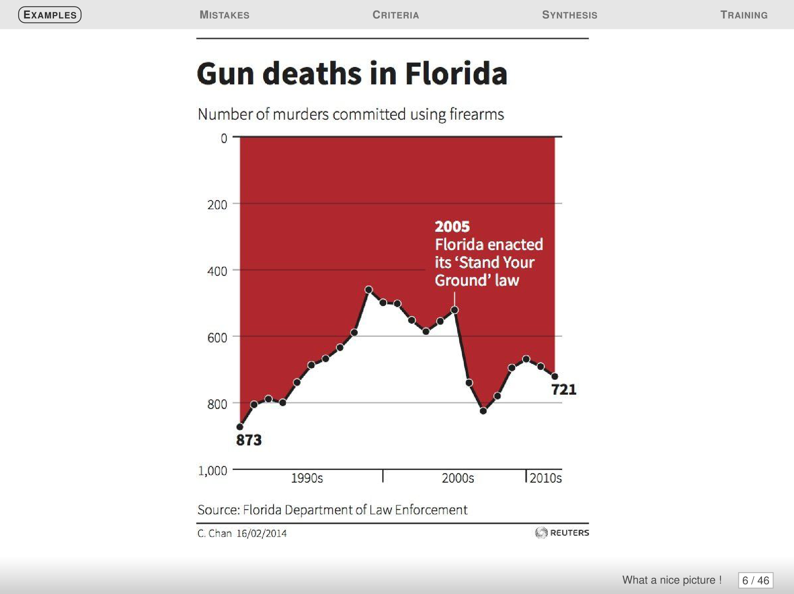

---
output:
  pdf_document: default
  html_document: default
---

# Good Graphics Checklist

## First graph

### Bananas

I find it challenging to get a clear understanding of each year from this graph.

#### Data

-   [ ] Type of graphic adapted
-   [ ] Interpolation make sense
-   [x] Sufficient number of points
-   [ ] Building method clear
-   [ ] Confidence intervals visualized
-   [ ] Appropriate steps for histograms
-   [ ] Histograms visualize probabilities

#### Graphical objects

-   [ ] Graphical objects are readable on any support
-   [ ] Standard color range
-   [ ] Axis identified and labelled
-   [x] Scales units are explicit
-   [ ] No ambiguity when curves cross
-   [ ] Grid helps reading

#### Annotation

-   [ ] Axis are labelled by quantities
-   [ ] Labels of the axis are clear, and self contained
-   [ ] Units are indicated on the axis
-   [ ] Axes are oriented from bottom-left to top-right
-   [ ] Origin should be (0,0), if not it should be clearly justified
-   [x] No Hole on the axes
-   [x] the order's of graph/histogram bar is based on classical ordering
-   [x] Curves and Bar has legend

#### Information

-   [x] Curves on the same scale
-   [x] Less than 6 curves
-   [x] Compare curves on same graphics
-   [ ] A curve cannot be removed without reducing infos
-   [x] The graphic gives relevant infos
-   [ ] If showing average, don't forget the error bars
-   [ ] It is not possible to remove object without altering readability

#### Context

-   [x] All symbols used are defined and references
-   [ ] The graphics is the most appropriate representation for the data
-   [x] The graphic has a title
-   [x] The title is meaningful and self contained
-   [ ] The graphic is referenced in text
-   [ ] The text comment the figure

#### Comment: The graph is not good at all. It contains many colors, and the banana drawing also does not sing anything. I think that the goal of the graph is to compare countries in terms of exported quantities, and this is difficult to read from this graph.

## Second graph

### Death

#### Data

-   [x] Type of graphic adapted
-   [ ] Interpolation make sense
-   [x] Sufficient number of points
-   [x] Building method clear
-   [ ] Confidence intervals visualized
-   [ ] Appropriate steps for histograms
-   [ ] Histograms visualize probabilities

#### Graphical objects

-   [x] Graphical objects are readable on any support
-   [ ] Standard color range
-   [ ] Axis identified and labelled
-   [x] Scales units are explicit
-   [ ] No ambiguity when curves cross
-   [ ] Grid helps reading

#### Annotation

-   [ ] Axis are labelled by quantities
-   [ ] Labels of the axis are clear, and self contained
-   [ ] Units are indicated on the axis
-   [ ] Axes are oriented from bottom-left to top-right
-   [x] Origin should be (0,0), if not it should be clearly justified
-   [x] No Hole on the axes
-   [x] the order's of graph/histogram bar is based on classical ordering
-   [ ] Curves and Bar has legend

#### Information

-   [x] Curves on the same scale
-   [x] Less than 6 curves
-   [ ] Compare curves on same graphics
-   [ ] A curve cannot be removed without reducing infos
-   [x] The graphic gives relevant infos
-   [ ] If showing average, don't forget the error bars
-   [x] It is not possible to remove object without altering readability

#### Context

-   [x] All symbols used are defined and references
-   [ ] The graphics is the most appropriate representation for the data
-   [x] The graphic has a title
-   [x] The title is meaningful and self contained
-   [x] The graphic is referenced in text
-   [ ] The text comment the figure

####  Comment: As for this graph, I find it to be a beautiful and expressive form, but it is not readable at first glance. It requires a little thought to know the purpose of the representation of killing. We lose people the more killing there is, and this is not an increase, but rather a loss for us, which means we are down, as the author reversed the vertical axis and made it start from the end

## Third graph

### COVID-19

#### Data

-   [x] Type of graphic adapted
-   [ ] Interpolation make sense
-   [x] Sufficient number of points
-   [x] Building method clear
-   [ ] Confidence intervals visualized
-   [ ] Appropriate steps for histograms
-   [ ] Histograms visualize probabilities

#### Graphical objects

-   [x] Graphical objects are readable on any support
-   [x] Standard color range
-   [ ] Axis identified and labelled
-   [ ] Scales units are explicit
-   [x] No ambiguity when curves cross
-   [ ] Grid helps reading

#### Annotation

-   [x] Axis are labelled by quantities
-   [x] Labels of the axis are clear, and self contained
-   [ ] Units are indicated on the axis
-   [x] Axes are oriented from bottom-left to top-right
-   [ ] Origin should be (0,0), if not it should be clearly justified
-   [ ] No Hole on the axes
-   [ ] the order's of graph/histogram bar is based on classical ordering
-   [x] Curves and Bar has legend

#### Information

-   [x] Curves on the same scale
-   [x] Less than 6 curves
-   [x] Compare curves on same graphics
-   [x] A curve cannot be removed without reducing infos
-   [x] The graphic gives relevant infos
-   [ ] If showing average, don't forget the error bars
-   [ ] It is not possible to remove object without altering readability

#### Context

-   [x] All symbols used are defined and references
-   [x] The graphics is the most appropriate representation for the data
-   [x] The graphic has a title
-   [x] The title is meaningful and self contained
-   [x] The graphic is referenced in text
-   [ ] The text comment the figure

####  Comment : There is a problem with the x-axis and the vertical axis, as the horizontal axis is not drawn clearly, which creates confusion for the reader. Also, the vertical axis, the distance between 100 and 200, does not correspond to the distance from 0 to 100, and this is unacceptable In addition, the vertical axis should or usually start from the number 0. Here it started on the 30.

###  Note : you can find sketches (idea to make the graphs better) for The Bananas and  The Covid graph in the folder Sketches.

